# Architecture

> interfaces and workflows that they liked and felt at ease with
>
> [*Steve Yegge*](https://gist.github.com/chitchcock/1281611)

# Execution Flow

1. A user sends a request.
2. The server receives the request and parse headers.
3. The `Router` investigates the request URI and headers,
    decide which `Handler` to invoke to handle the request.
4. `Filter` may modify headers that handlers will receive, or can interrupt and return its own response.
5. The `Handler` receives the request, and returns a response to it.
6. `Handler`s can call `Parser` to parse the http body into an appropriate class.
7. The body object inside the response is converted to the output stream by `Renderer`.

# Routing

## `StandardRouter`

# `Config`

* `AbuConfig.create()`
* `AbuPojoConfig`
* `AbuConfig.json()` `AbuConfig.yaml()` `AbuConfig.properties()`
* `AbuLightbendConfig.load()`

# Some design caveats you should consider

* The classes inside the package named `internal` should not be used by the application.
  Those classes might have breaking changes in the future.
* `Serializable` is **NOT** supported at all. You must not serialize any classes of the framework.
* Most implementations are immutable thus thread safe.
  The classes annotated by `@Mutable` is mutable, thus should be carefully shared between threads.
